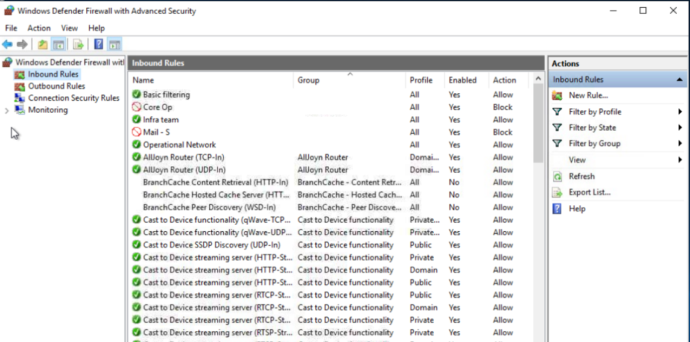
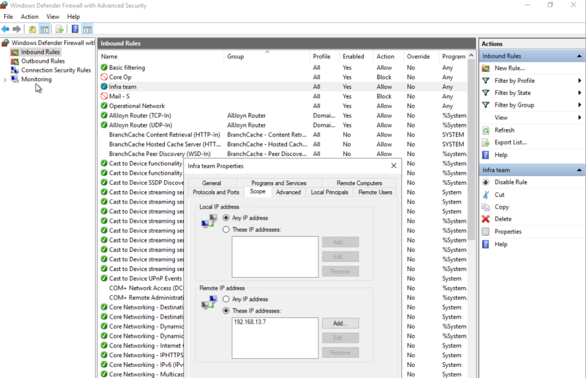

Here i want to share about my writeup for the room [Firewall Fundamentals](https://tryhackme.com/room/firewallfundamentals) (Premium Room), learn about firewalls and get hands-on with Windows and Linux built-in firewalls. I wrote this in 2025 and hope it is useful for learning about cybersecurity.

## Task 1: What Is the Purpose of a Firewall

A firewall is designed to inspect a network's or digital device’s incoming and outgoing traffic.

### Learning Objectives

After completing the room, you will have a basic understanding of the following areas:

- The types of firewalls
- The firewall rules and its components
- Hands-on Windows built-in firewall
- Hands-on Linux built-in firewall

### Room Prerequisites

- Networking Concepts

Which security solution inspects the incoming and outgoing traffic of a device or a network?
>Firewall

## Task 2: Types of Firewalls

There are many different types of firewalls, and they work on different OSI model layers.

- Stateless Firewall
- Stateful Firewall
- Proxy Firewall
- Next-Generation Firewall (NGFW)

Which type of firewall maintains the state of connections?
>stateful firewall

Which type of firewall offers heuristic analysis for the traffic?
>Next-Generation Firewall

Which type of firewall inspects the traffic coming to an application?
>Proxy firewalls

## Task 3: Rules in Firewalls

The basic components of a firewall’s rule are:

- Source address
- Destination address
- Port
- Protocol
- Action
- Direction

Three main actions can be applied to a rule:

- Allow
- Deny
- Forward

Firewalls have different categories of rules based on traffic directionality:

- Inbound Rules
- Outbound Rules

Which type of action should be defined in a rule to permit any traffic?
>allow

What is the direction of the rule that is created for the traffic leaving our network?
>outbound

## Task 4: Windows Defender Firewall

Windows Defender is a built-in firewall introduced by Microsoft in the Windows OS.

What is the name of the rule that was created to block all incoming traffic on the SSH port?
>Core Op

A rule was created to allow SSH from one single IP address. What is the rule name?
>Infra team

Which IP address is allowed under this rule?
>192.168.13.7

## Task 5: Linux iptables Firewall

Linux offers the functionality of a built-in firewall.

### Netfilter

**Netfilter** is the framework inside the Linux OS with core firewall functionalities, including packet filtering, NAT, and connection tracking. Common firewall utilities that utilize this framework are `iptables`, `nftables`, and `firewalld`.

### ufw (Uncomplicated Firewall)

`ufw`, as the name says, eliminates the complications of making rules in a complex syntax by giving you an easier interface. Some basic `ufw` commands include:

- `sudo ufw status`: To check the status of the firewall.
- `sudo ufw enable`: To enable the firewall.
- `sudo ufw deny 22/tcp`: To deny incoming traffic on a specific port.
- `sudo ufw status numbered`: To list all active rules in a numbered order.
- `sudo ufw delete <number>`: To delete a rule.

Which Linux firewall utility is considered to be the successor of "iptables"?
>nftables

What rule would you issue with ufw to deny all outgoing traffic from your machine as a default policy? (answer without sudo)
>ufw default deny outgoing
