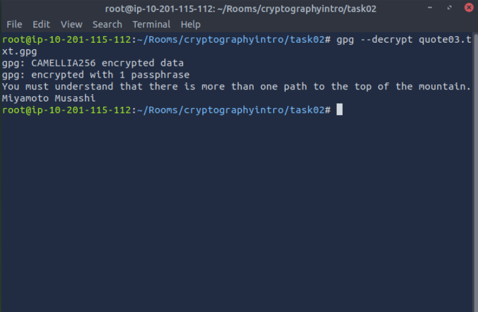

Here i want to share about my write-up for the room [Introduction to Cryptography](https://tryhackme.com/room/cryptographyintro), learn about encryption algorithms such as AES, Diffie-Hellman key exchange, hashing, PKI, and TLS. I wrote this in 2025 and hope it is useful for learning about cybersecurity.

## Task 1: Introduction

Using a tool similar to the `quipqiup` website, the ciphertext is automatically decrypted by analyzing letter frequencies and common word patterns.

* **Encrypted Quote:** `Xjnvw lc sluxjmw jsqm wjpmcqbg jg wqcxqmnvw; xjzjmmjd lc wjpm sluxjmw jsqm bqccqm zqy.`
* **Decrypted Quote:** "There is nothing more powerful than an idea whose time has come; nothing is more powerful than an idea whose time has come."

* **Encrypted Author:** `Zlwvzjxj Zpcvcol`
* **Decrypted Author:** `Victor Hugo`

You have received the following encrypted message:

“Xjnvw lc sluxjmw jsqm wjpmcqbg jg wqcxqmnvw; xjzjmmjd lc wjpm sluxjmw jsqm bqccqm zqy.” Zlwvzjxj Zpcvcol

You can guess that it is a quote. Who said it?
>Miyamoto Musashi

## Task 2: Symmetric Encryption

A **symmetric encryption algorithm** uses the same key for encryption and decryption, converting **plaintext** (the original message) into **ciphertext** (the encrypted form).

The older **Data Encryption Standard (DES)** is no longer considered secure and has been replaced by the **Advanced Encryption Standard (AES)**, which uses a key size of 128, 192, or 256 bits and is still in use today. Symmetric algorithms can be **block ciphers**, which encrypt fixed-size blocks of data, or **stream ciphers**, which encrypt data byte by byte.

When used correctly, symmetric encryption provides **Confidentiality**, **Integrity**, and **Authenticity**. However, it has a significant scalability problem: the number of keys grows quickly as more users are added. For example, communication between 100 users requires almost 5000 different secret keys.

Two common programs that perform symmetric encryption are **GNU Privacy Guard (GPG)** and the **OpenSSL Project**.

Decrypt the file quote01 encrypted (using AES256) with the key s!kR3T55 using gpg. What is the third word in the file?
>waste

Decrypt the file quote02 encrypted (using AES256-CBC) with the key s!kR3T55 using openssl. What is the third word in the file?
>science

Decrypt the file quote03 encrypted (using CAMELLIA256) with the key s!kR3T55 using gpg. What is the third word in the file?
>understand

## Task 3: Asymmetric Encryption

**Asymmetric encryption** makes it possible to exchange encrypted messages without a secure channel. When using an asymmetric encryption algorithm, we generate a key pair: a **public key**, which is shared with the world, and a **private key**, which must be saved securely. If a message is encrypted with one key, it can be decrypted with the other.

To achieve **confidentiality**, we encrypt a message using the recipient’s public key, and they can decrypt it using their private key.

To achieve **integrity, authenticity, and nonrepudiation**, we encrypt a message using your private key, and recipients can decrypt it using your public key.

## Task 4: Diffie-Hellman Key Exchange

## Task 5: Hashing

## Task 6: PKI and SSL/TLS

## Task 7: Authenticating with Passwords

## Task 8: Cryptography and Data - Example

## Task 9: Conclusion
